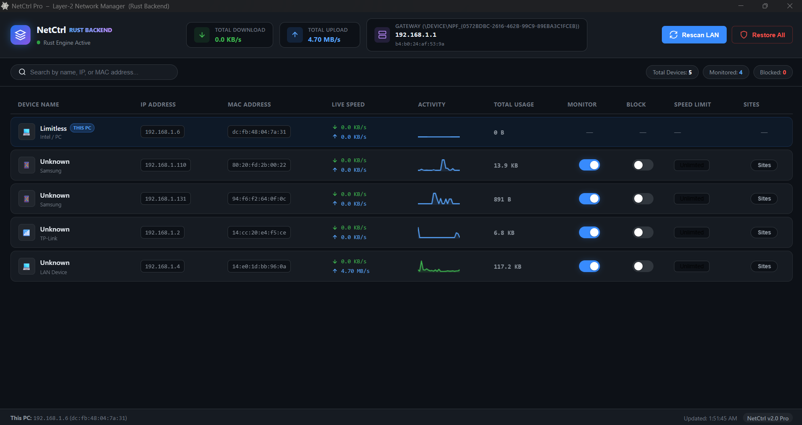

# NetCtrl Pro

**High-Performance Layer-2 LAN Bandwidth Manager & ARP Controller**

[](https://python.org)
[](https://rustup.rs)
[](https://microsoft.com)
[](https://npcap.com)
[](LICENSE)

NetCtrl is a modern Layer-2 network management and bandwidth control suite designed for local area networks (LAN). Utilizing high-performance ARP spoofing and packet filtering, NetCtrl allows network administrators to monitor real-time traffic per host, inspect visited domains, enforce bandwidth speed limits, or completely block network access.

---

## 🎨 Dual User Interface Experience

NetCtrl provides **two user interface modes** suited for different workflows:

### 1. Modern Cyber Dark Dashboard (Default)
A fluid, modern UI powered by PyWebView featuring hardware-accelerated animations, live traffic sparklines, automated vendor logo badges, visited sites drawer, and preset rate limits.



* **Real-time Sparklines:** 60 FPS live activity graph per connected device.
* **Smart Vendor Detection:** Automatically identifies device manufacturers (Apple, Samsung, Xiaomi, TP-Link, Intel, Dell, etc.) and detects randomized MAC addresses (`Private / Phone 📱`).
* **Visited Websites Drawer:** Smooth sliding side-drawer displaying captured DNS requests per device in real time, with instant domain search and one-click copy.
* **Speed Limiter Presets:** Modal dialog with quick bandwidth presets (64 KB/s, 128 KB/s, 256 KB/s, 1 MB/s, Unlimited) and custom rate input.
* **One-Click Emergency Restore:** Top-bar "Restore All" button to instantly un-monitor, unblock, and heal the entire network's ARP tables.
* **Inline Renaming:** Double-click or click ✏️ to customize device names with instant persistent JSON storage.

---

### 2. Classic Lightweight GUI (Tkinter)
A minimalist, zero-overhead desktop window designed for quick diagnostics and ultra-low system resource consumption.


---

## ⚡ How to Switch Between Interfaces

### Running the Pre-compiled Standalone Executable (`NetCtrl.exe`):

```bash
# Launch Modern Cyber Dashboard (Default):
NetCtrl.exe

# Launch Classic Lightweight GUI:
NetCtrl.exe --classic-gui
# (or NetCtrl.exe --legacy-gui)
```

### Running from Python Source:

```bash
# Launch Modern Cyber Dashboard (Default):
python main.py --rust

# Launch Classic Lightweight GUI:
python main.py --rust --classic-gui
```

---

## 🚀 Key Features

* **Subnet-Aware Discovery:** Broadcast ARP scanning tailored to your actual subnet mask (e.g. `/24`), preventing interference with VPN virtual adapters.
* **Dual Architecture Engine:**
  * **Rust High-Throughput Engine:** Token-bucket rate limiting, sub-millisecond layer-2 packet forwarding, zero packet drops under load.
  * **Python Fallback Engine:** Pure-Python implementation if running without the compiled binary.
* **Local HTTP REST API:** Rust backend operates on `http://127.0.0.1:8765`, enabling scriptable network control and dashboard communication.
* **DNS Inspection & Domain Logging:** Inspects outgoing port 53 DNS queries to provide a visited website history per target host.
* **Automatic Gateway & Local Host Protection:** Your local machine is permanently identified, pinned at the top, and protected against accidental blocking or rate-limiting.

---

## 📋 Requirements

* **Operating System:** Windows 10 or Windows 11 (64-bit)
* **Administrator Privileges:** Required for raw packet capture and ARP transmission.
* **Npcap Driver:** Must be installed on the machine ([Download Npcap](https://npcap.com)).

---

## 📥 Installation & Setup

### ⚡ Quick Install (Zero Dependencies — Recommended)
For immediate plug-and-play installation without manually installing Python, Rust, or configuring drivers:
1. Download **`NetCtrl_Setup.exe`** directly from the repository / releases.
2. Run `NetCtrl_Setup.exe` as Administrator.
3. The setup automatically installs the required Npcap driver in WinPcap-compatible mode, extracts all core components, and creates a desktop shortcut.
4. Launch NetCtrl directly!

---

### Option A — Run the Portable Executable
If you already have Npcap installed and prefer a single portable `.exe` without installation:
1. Ensure Npcap is installed from [npcap.com](https://npcap.com) (with **"Install Npcap in WinPcap API-compatible Mode"** enabled).
2. Download or locate `NetCtrl.exe` in `dist/`.
3. Right-click and choose **Run as administrator** (or double-click; it will automatically request UAC elevation).
4. On first launch, select your active network interface (Wi-Fi or Ethernet).

---

### Option B — Run or Build from Source

#### 1. Clone the repository:
```bash
git clone https://github.com/Ahmed-Eissa-0/NetCtrl.git
cd NetCtrl
```

#### 2. Install Python dependencies:
```bash
pip install -r requirements.txt
```

#### 3. Compile the Rust Engine:
Make sure you have [Rust installed](https://rustup.rs) and Visual Studio C++ Build Tools.
```bash
cd rust_engine
cargo build --release
copy target\release\rust_engine.exe ..\rust_engine.exe
cd ..
```

#### 4. Launch NetCtrl:
```bash
# Run with Modern Dashboard:
python main.py --rust

# Run with Classic GUI:
python main.py --rust --classic-gui
```

---

## 📦 Building Standalone Single EXE

To bundle everything (Python code, Rust engine, Web dashboard assets, and icons) into a single standalone `dist/NetCtrl.exe`:

Simply run:
```bat
build_exe.bat
```

Or manually using PyInstaller:
```bash
pyinstaller --onefile --noconsole --uac-admin \
  --add-data "rust_engine.exe;." \
  --add-data "device_names.json;." \
  --add-data "web;web" \
  --icon icon.ico \
  --workpath build_pkg \
  --distpath dist \
  --exclude-module matplotlib \
  --exclude-module pygame \
  --exclude-module PIL \
  --exclude-module IPython \
  --clean \
  --name "NetCtrl" \
  main.py
```

---

## 📁 Project Architecture

```
netctrl/
├── main.py                    # Application entrypoint & engine coordinator
├── gui_web.py                 # PyWebView bridge for modern dashboard
├── gui.py                     # Classic native Tkinter GUI
├── device_names.json          # Persistent custom device name mappings
├── requirements.txt           # Python dependencies
├── build_exe.bat              # One-click Windows build script
├── screenshot.png             # Classic GUI screenshot
├── Screenshot_NewGui.png      # Modern Dashboard screenshot
├── web/                       # Modern Cyber Dark Dashboard
│   ├── index.html             # Semantic dashboard markup
│   ├── style.css              # Cyber dark responsive styles & transitions
│   └── app.js                 # REST client, live polling, sparkline canvas
└── rust_engine/               # High-performance Rust L2 Core
    ├── Cargo.toml
    └── src/
        ├── main.rs            # Rust engine startup & CLI
        ├── server.rs          # Axum HTTP REST server (:8765)
        ├── l2_forwarder.rs    # Layer-2 forwarding & token-bucket rate limiter
        ├── spoofer.rs         # Raw ARP poisoning & healing routines
        ├── scanner.rs         # Active broadcast subnet ARP scanner
        └── device_registry.rs # Thread-safe concurrent device & DNS records
```

---

## ❓ Troubleshooting

| Issue | Cause & Solution |
|---|---|
| **Gateway MAC shows `--` or `??`** | Make sure you are running as **Administrator**. NetCtrl needs raw socket access. |
| **No devices discovered** | Click **Rescan LAN**. Ensure you picked the correct network interface during initial setup. You can reset your interface in `netctrl_config.json`. |
| **"Npcap not found" / Packet errors** | Reinstall Npcap from [npcap.com](https://npcap.com) and ensure **"WinPcap API-compatible Mode"** is checked. |
| **Antivirus false positive** | Because NetCtrl crafts low-level ARP frames for network administration, some heuristics may flag the standalone executable. This is normal for network tools like Wireshark/SelfishNet. Add `NetCtrl.exe` to exclusions or build from source. |

---

## ⚠️ Legal & Ethical Disclaimer

NetCtrl is developed for **network administration, performance diagnostics, and educational research only**. Intercepting or modifying network traffic on networks without explicit authorization from the network owner is illegal in many jurisdictions. The developers assume no liability for misuse of this software.

---

## 📄 License

This project is licensed under the [MIT License](LICENSE).